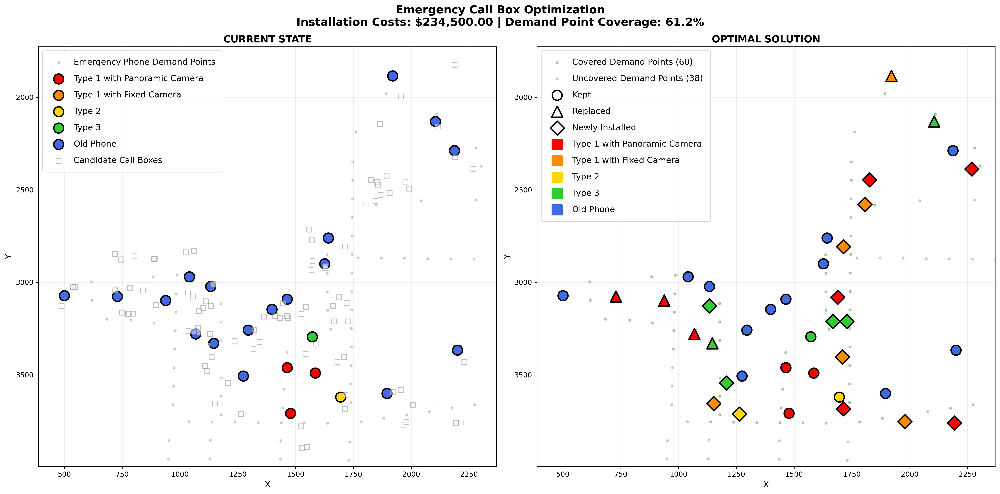

# Emergency Call Box Optimization

This repository contains a notebook-based spatial optimization project for campus emergency call boxes. The workflow starts from a campus map, extracts or traces spatial features, generates demand and candidate installation points, and solves a Gurobi optimization model to recommend which call boxes to keep, replace, or install.

## Project Workflow

1. `pdf_map_coord_extraction.ipynb`
   - Loads `campus_map.pdf`
   - Detects existing call box icons from the map
   - Uses traced building outlines to generate candidate call box locations
   - Uses traced route lines to generate demand points every 50 meters
   - Exports the CSV inputs used by the optimization model
2. `callbox_optimization_gurobi.ipynb`
   - Loads candidate locations, demand points, and current call box state data
   - Formulates and solves the emergency phone placement model in Gurobi
   - Reports coverage and installation decisions
   - Saves the final visualization to `emergency_callbox_optimization.png`

## Repository Contents

- `campus_map.pdf`: source map used for coordinate extraction and tracing
- `pdf_map_coord_extraction.ipynb`: preprocessing notebook for generating spatial inputs
- `callbox_optimization_gurobi.ipynb`: optimization notebook
- `building_outline_vertices.csv`: traced building polygon vertices
- `solid_line_vertices.csv`: traced main route polyline vertices
- `dotted_line_vertices.csv`: traced feeder route polyline vertices
- `exisiting_and_candidate_callbox_coords.csv`: 123 possible call box locations used by the model
- `existing_callbox_current_state.csv`: state of the 23 currently installed call boxes
- `demand_point_coords.csv`: 98 weighted demand points generated from campus routes
- `emergency_callbox_optimization.png`: exported visualization of the solution

## Model Snapshot

The optimization notebook uses:

- 23 existing call box locations
- 100 generated candidate locations
- 98 demand points
- a weighted minimum coverage requirement of `alpha = 0.65`
- phone-type-specific coverage radii of `150, 100, 60, 45, 20`

The current notebook output reports one feasible optimized solution with:

- 38 phones in period 1
- 60 of 98 demand points covered (`61.2%`)
- weighted coverage of `71.0 / 109.0` (`65.1%`)
- installation cost of `$234,500.00`

## Requirements

This project is organized around Jupyter notebooks. A typical Python environment for the notebooks includes:

- `jupyter`
- `pandas`
- `numpy`
- `matplotlib`
- `seaborn`
- `opencv-python`
- `Pillow`
- `PyMuPDF`
- `gurobipy`

`gurobipy` requires a working Gurobi installation and license.

## How To Run

1. Create a Python environment and install the required packages.
2. Launch Jupyter Notebook or JupyterLab in the repository root.
3. Run `pdf_map_coord_extraction.ipynb` if you want to regenerate the spatial input CSVs from the map and traced geometry.
4. Run `callbox_optimization_gurobi.ipynb` to solve the optimization model and regenerate the final figure.

Note: keep the filename `exisiting_and_candidate_callbox_coords.csv` as-is unless you also update the notebook references.

## Team

- Rui Zhao
- Serena Sun
- Arantzazu Arregui Gonzalez
- Chloee Liew
- Nicholas Stanfield
